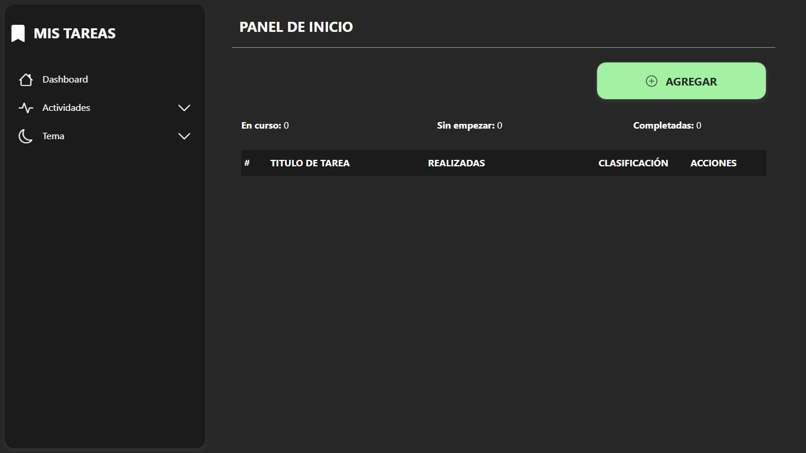

# To-do List API & Frontend

<br><br><br>

## Descrición

Este proyecto es una aplicación completa que combina una API REST desarrollada con Node.js y Express, junto con un frontend basado en HTML, CSS y JavaScript. La API se conecta con MongoDB para gestionar tareas, y el frontend interactúa con ella para mostrar la información dinámicamente.



## Tecnologías

Backend (API Rest)
- **Node.js** + **Express.js**.
- **MongoDB** + **Mongoose**.
- **dotenv** para variables de entorno.

Frontend
- **HTM**L, **CSS**, **JavaScript**.
- **Axios** para realizar peticiones a la API.
- **Eventos y manejo de interfaz dinámica**.

## Estructura del proyecto

```bash
├── src/                # Backend - API REST
│   ├── config/         # Configuraciones de la aplicación
│   ├── controllers/    # Lógica de negocio de la API
│   ├── models/         # Definición de modelos de datos
│   ├── routes/         # Endpoints de la API
│   ├── app.js          # Archivo principal del servidor
│
├── public/             # Frontend
│   ├── index.html      # Plantilla principal
│   ├── js/             # Scripts de interacción con la API e interaccion del frontend
│   ├── css/            # Estilos
│
├── .env                # Variables de entorno
├── package.json        # Dependencias y configuración de Node.js
└── README.md           # Documentación
```

## Instalación y configuración

1. Clonar el repositorio:
   ```bash
   git clone https://github.com/samoel-andres/to-do-list.git
   ```
2. Instalar dependencias:
   ```bash
   npm install
   ```
3. Configurar el archivo .env (crea en la raiz si no existe):
   ```bash
   PORT=YOUR_PREFERRED_PORT
   DB_URI=YOUR_DB_URI
   ```
4. Inicia el servidor:
   ```bash
   npm start
   ```
5. Accede a la aplicación en tu navegador en `http://localhost:PORT`
   - Asume que **PORT** es el puerto que especificaste en el archivo .env que has creado previamente.

## Endpoints de la API

### Obtener todas las tareas
`GET /find/documents/all`

### Crear una tarea
```bash
POST /create-task
Content-Type: application/json
{
    "task": {
        "title": "Nueva tarea",
        "clasification": "Normal | Muy importante",
        "observation": "",
        "list": [
            {
                "task": "Subtarea 1",
                "done": true | false
            }
        ]
    }
}
```

### Actualizar una tarea
```bash
PUT /update-task/:id
```

### Eliminar una tarea
```bash
DELETE /delete-task/:id
```

## Funcionalidades del Frontend
- Listar tareas obtenidas desde la API
- Crear nuevas tareas.
- Marcar tareas como completadas.
- Editar detalles de cualquier tarea.
- Eliminar tareas.
- Interfaz dinámica con eventos JavaScript.
- Opción de selección entre tema obscuro, claro o automático.
- Interfaz responsive e intuitiva.
